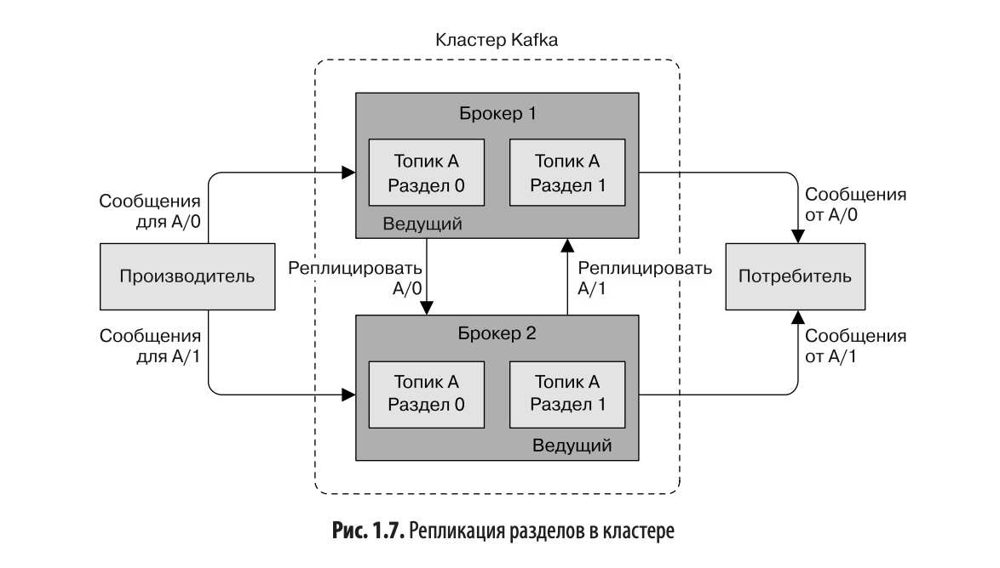

### Открываем для себя систему kafka

Сообщения в кафке хранятся в топиках (ближ. аналог - таблица), топики в свою очередь разделены на партиции (даёт возможность горизонтального масштабирования, если, например, разделять партиции по серверам), данные в партициях отсортированы, но это не гарантирует отсортированность данных во всём топике.
Помимо этого есть реплики разделов для отказоустойчивости.

#### Продюсеры и консюмеры
Кафка устроена достаточно легко, продюсеры сами складывают сообщения в топик, консюмеры сами читают эти сообщения. Кафка только запоминает оффсет - индекс, на котором остановился читать консюмер (или группа консюмеров), чтобы потом можно было продолжить с прежнего места. По умолчанию продюсер кидает данные в разные партиции равномерно, но и конкретную можно задать.

#### Кластер kafka

Какой-то из живых брокеров автоматически выбирается ведущим и выполняет административную работу (распледеление партиций, мониторинг отказов брокеров), так же один брокер может содержать реплику партиции другого брокера, чтобы обеспечить отказоустойчивость.

### Интересные настройки

* num.recovery.threads.per.data.dir - потоки, используемые для обработки сегментов журналов, используются только при запуске и остановке кластера, поэтому можно задать число побольше (по дефолту 1)
* auto.leader.rebalance.enable - чтобы балансировать ведущие реплики на разных брокерах (чтобы все они не были на одном). Происходит это раз в какое-то время (параметр *leader.imbalance.interval.seconds*) или если превышен дисбаланс (параметр *leader.imbalance.per.broker.percentage*)
* default.replication.factor - рекоммендованное значение 2 или 3, если имеется достаточно мощности, так будет обеспечиваться одно запланированное, и одно незапланированное отключение брокеров с сохранением доступности всех данных
* log.retention.bytes - ограничение вместимости топика по объёму памяти
* log.retention.ms - топик чистится раз в какое-то время
* log.segment.bytes - сообщения полностью удаляются при достижении определённого объёма. Чтобы получить полный объём, при котором сообщение удалится, нужно сложить это значение с *log.retention.bytes*
* log.roll.ms - сообщения полностью удаляются через время. По факту, чтобы получить время полного удаления сообщения, нужно сложить это значение с *log.retention.ms*
* vm.swappiness - вероятность того, что система будет использовать пространство подкачки вместо того, чтобы удалить страницу из кэша. Лучше ставить это значение ниже, например 1

#### Передача данных по сети
Как можно настроить машину, чтобы данные по сети быстрее летали:
* net.core.wmem_default и net.core.rmem_default - объёмы (по умолчанию и максимальный) памяти, выделяемой для буферов отправки и получения для каждого сокета. В книге говорится о разумном значение в 2мб
* net.ipv4.tcp_wmem и net.ipv4.tcp_rmem - размеры буферов отправки и получения для сокетов TCP. В книге рекомендация 4096 65536 2048000
* net.ipv4.tcp_window_scaling - оконное масштабирование, что-то типа возможность буферизации данных на стороне брокера
* net.ipv4.tcp_max_syn_backlog - число одновременных подключений
* net.core.netdev_max_backlog - может держать подключения в бэклоге, помогает при сильных всплесках трафика
